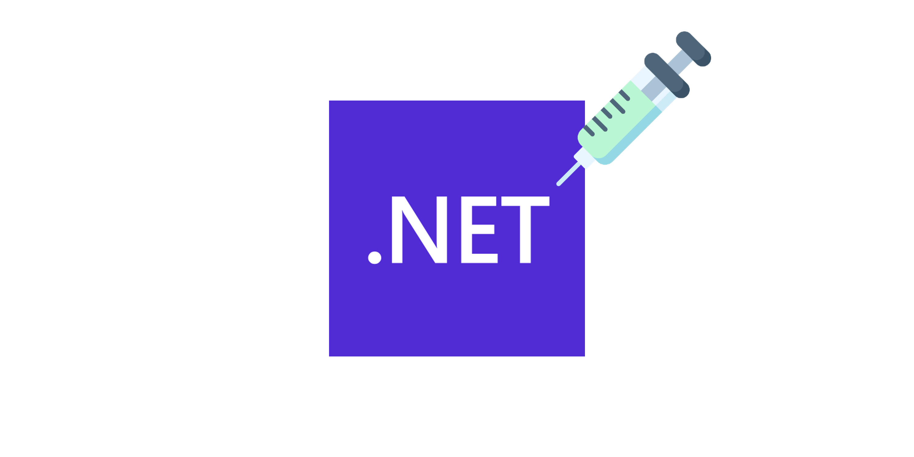

<p align="center"></p>

**.NET Assembly Injection Project**

Development period : 2024.10.25 ~ 2023.10.27

## Project Overview
This project provides a method to inject and execute .NET assemblies within unmanaged code processes, enabling seamless integration between managed and unmanaged code. The primary function, `NETInjection`, allows specific methods within a .NET assembly to be called with arguments and returns a result.

## Development Environment
- Visual Studio with C++ development environment
- .NET Framework 4.0 or higher
- Windows OS (tested on Windows 11)

## Installation
1. Clone or download the project repository to your local machine.
2. Open the project in Visual Studio.
3. Build the solution in Release mode to generate the DLL file.

## Usage
To use the injection function, `NETInjection`, include the generated DLL in your project and call `NETInjection` with the appropriate parameters as described below.

### Example
```cpp
DWORD returnValue;
NETInjection("C:\\path\\to\\assembly.dll", "Namespace.ClassName", "MethodName", "argument", &returnValue);
```

This will load `assembly.dll`, find `Namespace.ClassName`, execute `MethodName` with `argument`, and store the result in `returnValue`.

## Function Description

### `NETInjection`
```cpp
void NETInjection(const char* assembly, const char* typeName, const char* method, const char* argument, DWORD* returnValue);
```

- **Parameters**:
    - `assembly`: The file path to the .NET assembly (DLL) to be loaded.
    - `typeName`: The fully-qualified name of the class containing the method to be executed (e.g., `Namespace.ClassName`).
    - `method`: The name of the method to invoke.
    - `argument`: A string argument to pass to the method.
    - `returnValue`: Pointer for storing the return value from the executed method.


## Stack Used

### Development Environment


     

### Programming Language


## To-Do List
- [ ] Support for various types of parameters

## Precautions
This project holds no legal responsibility for any actions or consequences arising from its use.
